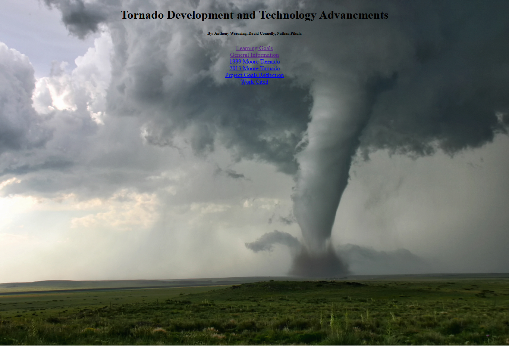
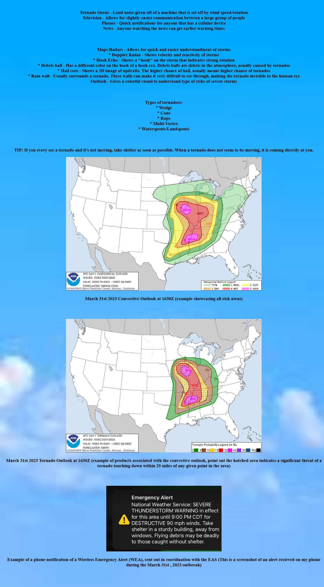
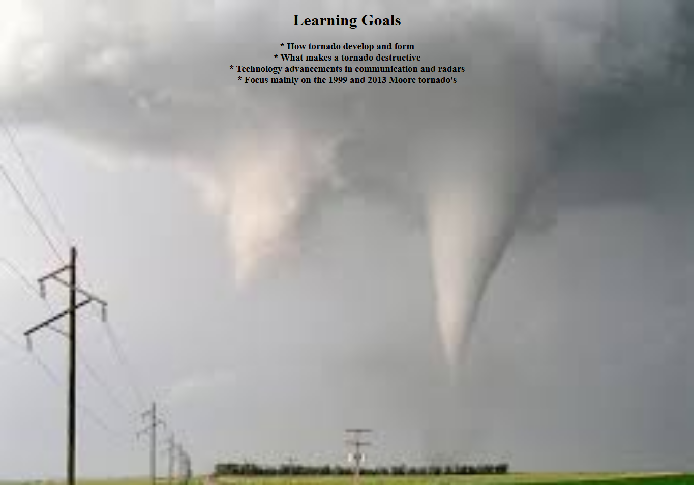
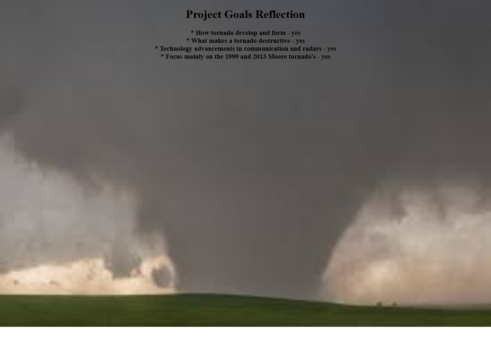
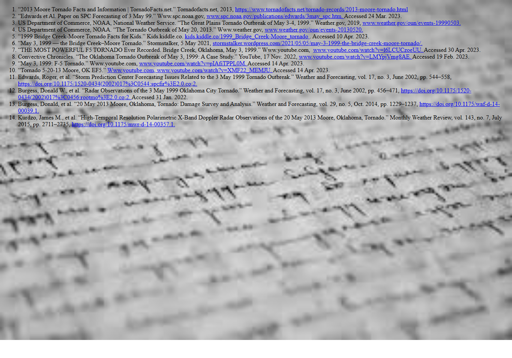

# Tornado Development and Technology Advancements

An educational multi-page website exploring the evolution of tornado detection technology and historical storm events in Moore, Oklahoma. This project highlights critical advancements in meteorology that have improved public safety and early warning systems.

## 🌪️ About the Project
This site serves as a comprehensive resource for understanding how tornado tracking has evolved over time. It compares major historical events—specifically the 1999 and 2013 Moore tornadoes—to showcase how technological shifts have impacted storm analysis and emergency response.

## 📸 Site Gallery

| Home Page | 2013 Moore Analysis |
|---|---|
|  |  |

| General Information | Learning Goals |
|---|---|
|  |  |

| 1999 Moore Analysis | Project Analysis |
|---|---|
|  |  |

| Work Cited |
|---|
|  |

## 🛠️ Built With
* **HTML5** & **CSS3** - Developed entirely by Anthony Wernsing.

## 👥 Team & Roles
* **Anthony Wernsing** - Lead Web Developer & UI Designer
* **David Connelly** - Lead Researcher & Content Strategist
* **Nathan Pikula** - Lead Researcher & Content Strategist

## 🚀 How to View
1. Clone or download the repository.
2. Open **`Index.html`** in your preferred web browser.
